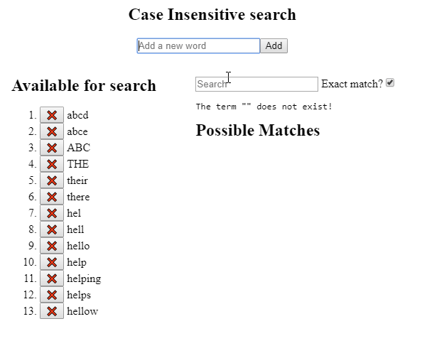

# `@cshooks/useTrie`


[](https://snyk.io/test/github/cshooks/hooks?targetFile=packages%2FuseTrie%2Fpackage.json)

A React Hook that returns a [Trie](https://en.wikipedia.org/wiki/Trie), which enables a fast text match ([Typeahead](https://en.wikipedia.org/wiki/Typeahead)).

# NPM Package

https://www.npmjs.com/package/@cshooks/usetrie

# Installation

```bash
npm install @cshooks/usetrie
```

_Note for beginners_:

- Don't install `@cshooks/usetrie` as a `devDependency` ([--save-dev](https://docs.npmjs.com/cli/install) flag for `npm install`) as it won't be included in your final build and will get an error complaining that the package cannot be found.
- This library has a [peer dependency](https://nodejs.org/en/blog/npm/peer-dependencies/) for React version `^16.8.0`: This library needs to have React version 16.8.0 & up required.

# Usage

You can initialize the trie with either an array of

1. strings
1. objects

## 1. Initializing the trie with an array of `strings`

Pass an array of string to the `useTrie` hook and optionally specify the case sensitivity  
(**default**: `isCaseInsensitive = true`)

```jsx
import useTrie from '@cshooks/usetrie';

function App() {
  const words = ['abcd', 'abce', 'ABC', 'THE', 'their', 'there'];
  const isCaseInsensitive = true;
  const trie = useTrie(words, isCaseInsensitive);

  // or initialize and add/remove words later on
  // It's case-INsensitive" by default
  const trie = useTrie();

  return <div>...</div>;
}
```

## 2. Initializing the trie with an array of `objects`

**Note** that you need to pass the text selector method to let `useTrie` know how to extract a text object from your object (refer to the 3rd parameter, `textSelector`).

```jsx
import useTrie from '@cshooks/usetrie';

function App() {
  const words = [
    { id: 1, text: 'a' metadata: "1 - a"},
    { id: 2, text: 'dog' metadata: "2 - dog"},
    { id: 3, text: 'cat' metadata: "3 - cat"},
    { id: 4, text: 'hel' metadata: "4 - hel"},
    { id: 5, text: 'hell' metadata: "5 - hell"},
    { id: 6, text: 'hello' metadata: "6 - hello"},
    { id: 7, text: 'help' metadata: "7 - help"},
    { id: 8, text: 'helping' metadata: "8 - helping"},
    { id: 9, text: 'helps' metadata: "9 - helps"},
  ];
  const isCaseInsensitive = true;
  const textSelector = row => row.text;
  const trie = useTrie(words, isCaseInsensitive, textSelector);
  // or just pass a lambda (anonymous function)
  const trie = useTrie(words, isCaseInsensitive, o => o.text);

  return <div>...</div>;
}
```

When you add a new "word" object to the trie, if you had already initialize the hook with a text selector method, then there is no need to specify it again.

```js
const trie = useTrie(words, isCaseInsensitive, o => o.text);
// ... elsewhere in the code
trie.add({ id: 99, text: 'large text here' });
```

If you have already initialized the hook with the text selector but specify it again in the `add`, then the text selector passed in the `add` overwrites the one specified during the initialization.

```js
const trie = useTrie(words, isCaseInsensitive, o => o.text);
// ... elsewhere in the code
trie.add({ id: 999, title: 'Title to search' }, o => o.title);
// No need to specify the text selector in subsequent "add" calls.
trie.add({ id: 123, title: 'Next title to search' });
```

When you add/remove an item in the trie, a new instance of trie is returned,
so you can monitor on the `trie` dep when searching for a word.

```js
const getMatches = React.useCallback(() => {
  return trie.search(state.term).map(word => <li key={word}>{word}</li>);
}, [trie]);
```

# Demo



[](https://codesandbox.io/s/3jzy58wqq)

<details>
  <summary>A Simple demo Source</summary>

```ts
import * as React from 'react';
import { render } from 'react-dom';

import useTrie, { Trie } from '@cshooks/usetrie';
import styled, { createGlobalStyle } from 'styled-components';

import './styles.css';

const log = console.log;

const ContentContainer = styled.section`
  display: grid;
  grid: 1fr / 2fr 3fr;
  margin-top: 2rem;
`;

function reducer(state, action) {
  switch (action.type) {
    case 'SET_WORD':
      return { ...state, word: action.word };
    case 'ADD_WORD':
      // Mutating the trie returns a new instance
      state.trie.add(action.word);
      return { ...state, words: [...state.words, action.word] };
    case 'REMOVE_WORD':
      const removed = state.words.filter(word => word !== action.word);
      // Mutating the trie returns a new instance
      state.trie.remove(action.word);
      return { ...state, words: [...removed] };
    case 'SET_TERM':
      return { ...state, term: action.term };
    case 'SET_ISEXACT': {
      return { ...state, isExact: action.isExact };
    }
    default:
      return state;
  }
}

function App() {
  // prettier-ignore
  const initialWords = [
    "abcd", "abce", "ABC", "THE", "their",
    "there", "hel", "hell", "hello", "help",
    "helping", "helps"
  ];
  const isCaseInsensitive = false;
  const trie = useTrie(initialWords, isCaseInsensitive);

  const initialState = {
    words: initialWords,
    word: '',
    term: '',
    isExact: true,
    trie,
  };
  const [state, dispatch] = React.useReducer(reducer, initialState);

  const checkIfTermExists = e =>
    dispatch({ type: 'SET_TERM', term: e.target.value });

  const removeWord = React.useCallback(
    (word: string) => {
      log(`removing "${word}"`);
      trie.remove(word);
      dispatch({ type: 'REMOVE_WORD', word });
    },
    [trie]
  );

  const AvailableWords = React.useMemo(
    () =>
      state.words.map(word => {
        return (
          <li key={word}>
            <button key={word} onClick={() => removeWord(word)}>
              ❌
            </button>{' '}
            {word}
          </li>
        );
      }),
    [state.words]
  );

  const setWord = React.useCallback(
    e => dispatch({ type: 'SET_WORD', word: e.target.value }),
    [state.word]
  );

  const addWord = React.useCallback(
    e => {
      e.preventDefault();

      dispatch({ type: 'ADD_WORD', word: state.word });
    },
    [state.word]
  );

  const getMatches = React.useCallback(() => {
    return trie.search(state.term).map(word => <li key={word}>{word}</li>);
  }, [trie]);

  return (
    <React.Fragment>
      <header>
        <h1>Case Insensitive search</h1>
      </header>
      <section>
        <form onSubmit={addWord}>
          <input
            placeholder="Add a new word"
            onChange={setWord}
            value={state.word}
          />
          <button type="submit">Add</button>
        </form>
      </section>
      <ContentContainer>
        <section>
          <h2>Available for search</h2>
          <ol>{AvailableWords}</ol>
        </section>
        <section>
          <article>
            <div>
              <input
                placeholder="Search"
                type="text"
                value={state.term}
                onChange={checkIfTermExists}
              />
            </div>
            <label>
              Exact match?
              <input
                type="checkbox"
                checked={state.isExact}
                onChange={e =>
                  dispatch({ type: 'SET_ISEXACT', isExact: e.target.checked })
                }
              />
            </label>
          </article>
          <article>
            The term "{state.term}"{' '}
            {trie.has(state.term, state.isExact) ? 'exists' : 'does not exist!'}
          </article>
          <article>
            <h2>Possible Matches</h2>
            <ol>{getMatches()}</ol>
          </article>{' '}
        </section>
      </ContentContainer>
    </React.Fragment>
  );
}

const GlobalStyle = createGlobalStyle({
  boxSizing: 'border-box',
});

const rootElement = document.getElementById('root');
render(
  <React.Fragment>
    <GlobalStyle />
    <App />
  </React.Fragment>,
  rootElement
);
```

</details>

## For both String & Object arrays

[](https://codesandbox.io/s/zz2mxlxzp)

# API

## useTrie

```ts
useTrie(
  initialWords: Words,
  isCaseInsensitive = true,
  getText?: (obj: any) => string = obj => obj
): Trie
```

- `initialWords: Words`: An array of string or object to populate the trie with
- `isCaseInsensitive: boolean`: Word comparison flag
  - Is "abc" === "ABC"? If `isCaseInsensitive === true`, then false else true
- `getText?: (obj: any) => string = obj => obj`: "Text" selector when when dealing with an object Array
  - e.g.) When `[{id: 1, text: "text1"}, {id: 2, text: "text2"}]` is passed as `initialWords`, then `o => o.text` would use the `text` property as the text to store internally.

```ts
/*
  Public types
*/
declare type Word = string | object;
declare type Words = Word[];
interface ITrie {
  has: (word: string, exactSearch: boolean = true) => boolean;
  add: (word: Word, getText?: (obj: any) => string) => void;
  remove: (word: string) => void;
  isEmpty: () => boolean;
  search: (word: string) => Words;
}
declare class Trie implements ITrie {
  constructor(
    words: Words = [],
    private isCaseInsensitive: boolean = true,
    private getText: (obj: any) => string = obj => obj
  );
  has: (wordToSearch: string, exactSearch: boolean = true) => boolean;
  add: (wordToAdd: Word, getText?: (obj: any) => string) => void;
  remove: (wordToRemove: string) => void;
  isEmpty: () => boolean;
  search: (wordToSearch: string) => Word[];
}
declare function useTrie(
  initialWords: Words,
  isCaseInsensitive?: boolean,
  getText?: (obj: any) => string
): ITrie;
export { ITrie, Trie, Word, Words };
export default useTrie;
```

## Trie

- `search = (word: string): string[]`
  - Search for the "word" in the trie
  - & returns an array of possible matches else an empty array.
    - e.g.) If the trie has ["abYZ", "abcd", "abce"], `trie.search('abc')` will return `["abcd", "abce"]`.
    - `trie.search('none-existing-word')` will return `[]`.
- `has = (word: string, exactSearch: boolean = true): boolean`
  - Check if the `word` exists in the trie
  - `word` - a word to search in trie
  - `exactSearch` - match the `word` exactly else does a fuzzy match
- `add: (wordToAdd: Word, getText?: (obj: any) => string) => void;`
  - Add the `word` to trie
  - If the `wordToAdd` is an object and not specified in the `useTrie`, then pass the `getText` callback to let `trie` know how to extract the text from the object.
    - This `getText` callback persists
- `remove = (word: string): void`
  - Remove the `word` from trie
- `isEmpty = (): boolean`
  - Check if the current trie contains any words in it or not

## Additional Note

`useTrie` returns an instance of type, `ITrie` instead of `Trie` due to `Trie` exposing more properties than necessary (due to lack of my TypeScript proficiency 😅)
